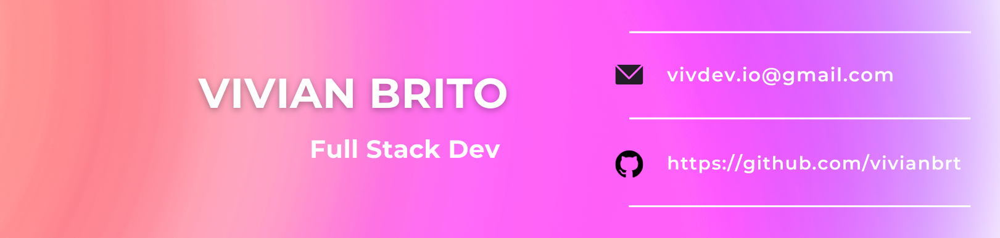

 

Após alguns anos atuando na minha área de formação, contabilidade, resolvi me dedicar a minha antiga paixão por tecnologia, realizando uma transição de carreira para a área de Desenvolvimento FullStack. Estou sempre em busca de novas habilidades e conhecimentos, procurando aplicar minhas experiências profissionais nesse novo caminho na tecnologia, como um diferencial. 

  

### My Skills

### Connect with me

### GitHub Stats

